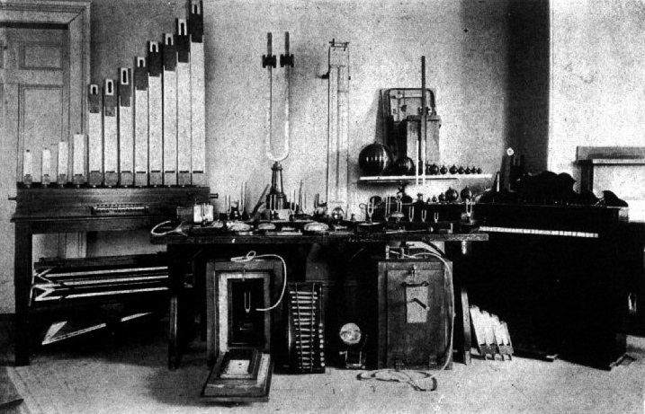

```{r setup, include=FALSE}
knitr::opts_chunk$set(echo = FALSE)

```



# Session information

Sessions take place Tuesdays, 8.15-9.45, Kollegienhaus, Aula 033. 
Slides will be made available shortly before each session. 

::: l-body
| # | Date       | Topic                               | Instructor | Resources                     |
|---| -----------|-------------------------------------|------------|-------------------------------|
| 1 | 22.09.2026 | [What kind of science is psychology?](index.html) | Mata | [Spektrum Podcast](https://www.spektrum.de/podcast/spektrum-podcast-zwischen-forschung-und-ratgebern/2282753) |
| 2 | 6.10.2026 | [The birth of psychology](index.html) | Mata | [Brysbaert & Rastle (2021; 4.1-4.2)](https://adam.unibas.ch/goto_adam_crs_301649.html) |
| 3 | 13.10.2026 | [Psychoanalysis](index.html) | Mata | [Brysbaert & Rastle (2021; 4.3-4.4)](https://adam.unibas.ch/goto_adam_crs_301649.html)|
| 4 | 20.10.2026 | [Behaviorism](index.html) | Mata |  [Brysbaert & Rastle (2021; 5.2)](https://adam.unibas.ch/goto_adam_crs_301649.html) |
| 5 | 03.11.2026 | [Gestalt and Cognitive psychology](index.html) | Mata | [Brysbaert & Rastle (2021; 4.2 & 5.3)](https://adam.unibas.ch/goto_adam_crs_301649.html)|
| 6 | 10.11.2026 | [Psychology today](index.html) | Tisdall |  [Spear (2007)](https://adam.unibas.ch/goto_adam_crs_1995736.html) |
| 7 | 17.11.2026 | [Psychotherapy research](index.html) | Tisdall |  [Braakmann (2015)](https://adam.unibas.ch/goto_adam_crs_301649.html) |
| 8 | 24.11.2026 | [Psychological testing](index.html) | Tisdall |  [Wasserman (2012)](https://adam.unibas.ch/goto_adam_crs_301649.html) |
| 9 | 01.12.2026 | [Decision science](index.html) | Tisdall | [Newell et al. (2022)](https://adam.unibas.ch/goto_adam_crs_301649.html) |
|10 | 08.12.2026 | [What kind of science is psychology? (revisited)](index.html) | Tisdall | [Ball (2012)](https://adam.unibas.ch/goto_adam_crs_301649.html) |
|11 | 15.12.2026 | Exam (see below) | | 
:::

# What is this course about?

This course offers a comprehensive introduction to the history of psychology, tracing its evolution from its philosophical origins to its development as a scientific discipline. It explores the contributions of ideas from the natural and social sciences to psychology and examines the emergence of various psychological schools of thought that have shaped our understanding of human mental processes and behavior, in particular from the 19th century to the present. Additionally, the course highlights the institutionalization of psychology as a science and its expanding role in diverse areas such as mental health, organizational and educational settings, or the communication of evidence and risk.

# What can you expect to learn?

By completing the course, you can expect to:

- Understand the historical roots and evolution of various schools of thought in psychology.
- Gain an overview of the development and key applications of psychological theory.
- Learn about the biographies and contributions of prominent psychologists.

# Exam

The exam will be held on December 15th, 2026 and it will consist of multiple-choice questions covering the content of all sessions. 

More information will be provided during the semester.

<!--The exam will take place in different locations:-->

<!-- **Last Name A–F** -->

<!-- Kollegienhaus, Hörsaal 001: Students with last names starting A up to and including F -->

<!-- **Last Name G–Z** -->

<!-- Bernoullianum, Grösser Hörsaal 148: Students will last names starting with G to Z -->

<!-- **Nachteilsausgleich** -->

<!-- Students notified individually by email (Missionsstr. 64a, Seminarraum 00.001) -->
# How should you use this website?

This website is designed to help course participants get an overview of the course sessions and access the course slides. 

<!-- A [FAQ](https://adam.unibas.ch/goto_adam_crs_1995736.html) forum is available on ADAM.  -->